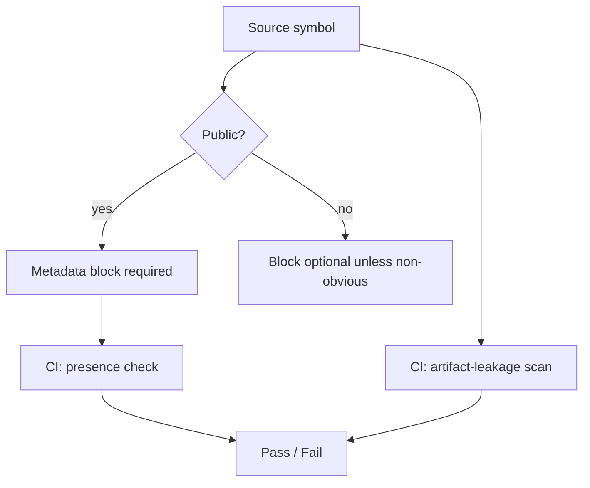

# Code Documentation Convention

**Version:** 0.1.0
**Status:** Draft
**Layer:** concept

## Overview

Defines how source code in the engine is documented so that both human engine
users and AI assistants can navigate, understand, and extend it accurately. The
convention has two policies: (P1) every public code symbol carries a compact,
machine-readable metadata block describing its purpose, usage, relations, and
stability; (P2) shipped code comments and user-facing documentation never leak
internal build-process artifacts. Together they make the codebase self-describing
for AI-assisted game development and keep generated specifications stylistically
uniform.

## Related Specifications

- [l1-build-tooling.md](l1-build-tooling.md) — CI runs the metadata-presence and artifact-leakage detection checks
- [l1-examples-framework.md](l1-examples-framework.md) — Example code is user-facing and MUST follow this convention
- [l1-ai-assistant-system.md](l1-ai-assistant-system.md) — AI assistant consumes the structured metadata for code reasoning
- [l1-cli-tooling.md](l1-cli-tooling.md) — Scaffolding/codegen output MUST emit conformant metadata

## 1. Motivation

The engine is designed to be driven by AI assistants building games on top of it.
An AI gives more accurate answers and generates better code when each symbol
states, in a fixed shape, *what it is for*, *how to use it*, *what it relates to*,
and *how stable it is* — instead of forcing the model to infer all of that from
implementation details.

This convention exists to:

1. Make the public surface self-describing for both humans and AI, in one
   predictable format.
2. Reduce hallucination: a controlled metadata block is cheaper and safer to
   read than reconstructed intent.
3. Keep generated specifications uniform — specs derived from code inherit a
   single documentation style.
4. Stop internal build-process scaffolding (task IDs, workflow/spec file
   references, `.design/` paths) from leaking into shipped code and public docs,
   where it rots and confuses engine users.

## 2. Constraints & Assumptions

- The metadata block is **additive**: it follows the existing human-readable
  documentation summary; it never replaces or restates it.
- The metadata is **terse and fluff-free** — optimised for fast machine and
  human scan, not prose.
- The format is **fixed and parseable**: a stable label, an ordered field set,
  and a controlled stability vocabulary.
- The convention is **language-agnostic at this layer**; the concrete syntax is
  defined by the Layer 2 implementation spec.
- Detection of both policies must be **CI-checkable** (presence of metadata on
  the public surface; absence of build-artifact leakage).
- This is a project-wide standard and is therefore a `RULES.md` §7 convention
  candidate (trigger T1). Codification is **proposed, not auto-applied** — see
  the Post-Update Review handoff.

## 3. Core Invariants

Rules that Layer 2 implementations MUST NOT violate:

- **INV-1**: Every public (externally visible) code symbol carries a metadata
  block stating its purpose, usage, relations, and stability.
- **INV-2**: The metadata block is appended *after* the human-readable summary.
  The documentation tool's primary summary line stays idiomatic and unchanged.
- **INV-3**: The metadata uses a fixed block label, a fixed ordered field set,
  and a controlled stability vocabulary. Field order is invariant.
- **INV-4**: Relations in the metadata reference **code symbols only** — never
  build-process artifacts, workflow names, or specification files.
- **INV-5**: No shipped code comment, docstring, or user-facing document
  references SDD workflow artifacts: task identifiers, phase/track identifiers,
  workflow command names, specification filenames, or `.design/` paths.
- **INV-6**: The metadata is non-duplicative and must not contradict the symbol
  it documents (signature, behavior, or stability reality).
- **INV-7**: Both policies are mechanically detectable so CI can enforce them
  without human judgement: (a) public symbols missing the block, (b) any
  workflow-artifact reference in shipped comments or user docs.

> L2 spec cannot reach RFC status until all invariants here are addressed in its
> "Invariant Compliance" section.

## 4. Detailed Design

### 4.1 Policy P1 — Machine-Readable Symbol Metadata

Each public symbol's documentation has two parts in order:

1. The conventional human-readable summary (unchanged idiomatic doc prose).
2. A trailing metadata block with a fixed label and these ordered fields:

   - **Purpose** — what the symbol is for and why it exists (1–2 lines, no fluff).
   - **Usage** — the smallest realistic way to use it (a minimal call form or a
     one-line usage note). When genuinely trivial, an explicit "not applicable"
     note with a reason is used rather than omission.
   - **Related** — references to *code symbols* that a reader/AI should follow
     next (sibling constructors, the type a function returns, the builder that
     produces it). No prose, no external artifacts.
   - **Stability** — one value from a controlled vocabulary:
     - `Stable` — part of the supported public contract.
     - `Experimental` — usable but may change without a major bump.
     - `Internal` — internal surface, no external compatibility promise.
     - `Deprecated` — superseded; the replacement symbol MUST be named.

The block is uniform enough that a tool can extract it deterministically and an
AI can rely on field semantics without parsing implementation code.

### 4.2 Policy P2 — Workflow-Artifact Hygiene

Shipped code comments, docstrings, and any user-facing documentation MUST NOT
mention build-process scaffolding, including (non-exhaustive):

- task identifiers and phase/track identifiers,
- SDD workflow command names,
- specification filenames,
- `.design/` (or equivalent process-directory) paths.

That information belongs in version-control history, specifications, and the
implementation plan — not in artifacts an engine user reads. The metadata
block's `Related` field is bound by INV-4: it may only point at code symbols,
which reinforces this policy at the one place process leakage is most tempting.

### 4.3 Enforcement Surface

Detection is delegated to the build tooling (see
[l1-build-tooling.md](l1-build-tooling.md)): one check asserts the metadata
block is present on the required public surface; a second check scans shipped
comments and user docs for forbidden workflow-artifact references. Both run in
the same pipeline as the rest of the quality gates.

### 4.4 Scope Tiers (conceptual)

- **Mandatory**: the user-facing public API surface.
- **Recommended**: internally public symbols that form the conceptual surface
  (primary types, constructors, key operations).
- **Optional**: non-public helpers, applied only when intent is non-obvious.
- **Excluded**: test-only code and generated files.

The Layer 2 spec binds these tiers to concrete code locations.

## 5. Open Questions

- Should the controlled stability vocabulary include a fifth value for
  not-yet-implemented surface, or is `Experimental` sufficient?
  <!-- TBD: confirm vocabulary closed-set with maintainers -->
- Does the artifact-leakage scan cover only source comments and generated user
  docs, or also hand-written long-form docs under the documentation tree?
  <!-- TBD: define exact file globs for the leakage scan -->
- Exact boundary of the "Recommended" tier — which internally public symbols
  count as conceptual surface vs. incidental.
  <!-- TBD: enumerate per package in L2 once the public surface stabilises -->

## Canonical References

<!-- MANDATORY for Stable status. List authoritative source files that downstream
     agents MUST read before implementing this spec. Use relative paths from
     project root. Stub state — populate when implementation lands. -->

| Alias | Path | Purpose |
| :--- | :--- | :--- |

<!-- Empty table = no canonical sources yet. Stable promotion requires ≥1 row. -->

## Document History

| Version | Date | Description |
| :--- | :--- | :--- |
| 0.1.0 | 2026-05-15 | Initial draft: AI-readable symbol metadata (P1) and workflow-artifact hygiene (P2) conventions |
| — | — | Planned examples: [examples/ecs/poc/](../../../examples/ecs/poc/) |
