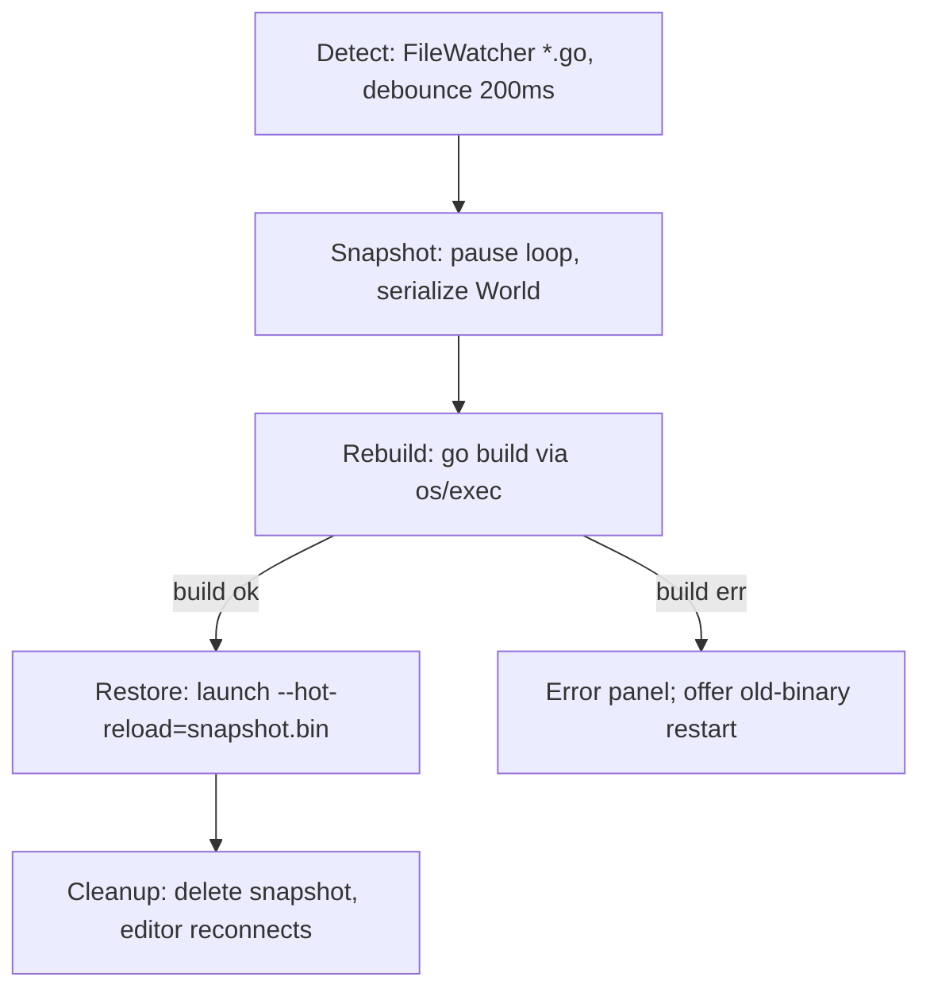

# Hot-Reload System — Go Implementation

**Version:** 0.1.0
**Status:** Draft
**Layer:** go
**Implements:** l1-hot-reload.md

## Overview

This specification defines the Go realization of the [Hot-Reload System](l1-hot-reload.md). Because Go cannot replace code in a running process, the implementation uses **process-restart with a state snapshot**: the running engine serializes its `World` to disk, exits cleanly, an orchestrator rebuilds and relaunches the binary, and the new process restores the snapshot — preserving entity IDs, components, resources, hierarchy, and app state. Shader hot-swap, by contrast, runs entirely **in-process** with a double-buffered program handle swap.

All hot-reload code is gated behind `//go:build editor` — it is a development-only feature, fully excluded from production builds (INV-4). The design reuses shipped infrastructure rather than inventing new machinery: the scene-serialization codec ([l2-scene-system-go.md](l2-scene-system-go.md)), the `TypeRegistry` ([l2-type-registry-go.md](l2-type-registry-go.md)), the stdlib dev file-watcher ([l2-asset-system-go.md](l2-asset-system-go.md)), the `EntityAllocator` ([l2-entity-system-go.md](l2-entity-system-go.md)), and the editor IPC wire ([l2-multi-repo-architecture-go.md](l2-multi-repo-architecture-go.md) / `pkg/protocol`).

## Related Specifications

- [l2-scene-system-go.md](l2-scene-system-go.md) — `DynamicScene` reflection codec + two-pass remap reused for the snapshot format
- [l2-type-registry-go.md](l2-type-registry-go.md) — component (de)serialization + the new `RegisterAlias` migration hook
- [l2-asset-system-go.md](l2-asset-system-go.md) — stdlib dev `FileWatcher` is the sole reload trigger (no polling)
- [l2-entity-system-go.md](l2-entity-system-go.md) — `EntityAllocator` free-list reconstruction for ID preservation (INV-5)
- [l2-app-framework-go.md](l2-app-framework-go.md) — `--hot-reload` flag handling, `Plugin.Cleanup` reverse order, RunMode
- [l2-multi-repo-architecture-go.md](l2-multi-repo-architecture-go.md) — `pkg/protocol` IPC messages between editor and engine
- [l2-diagnostic-system-go.md](l2-diagnostic-system-go.md) — shader-error and reload-metric overlay rendering
- [l2-profiling-protocol-go.md](l2-profiling-protocol-go.md) — `Reload:{phase}` timing spans
- [l2-render-core-go.md](l2-render-core-go.md) — shader program handle, double-buffered swap

## 1. Motivation

Restarting a Go engine is fast to *build* but ruinous to *iterate* — every restart loses entity positions, camera state, the active game-flow state, and editor inspector selection. The L1 spec's answer is to make the restart invisible to the developer: snapshot the World, rebuild, restore. The Go implementation must make that round-trip (a) **state-faithful** (the same entities, same IDs, same component values come back) and (b) **safe under failure** (a build error or a corrupt snapshot degrades to a clean start with an error overlay, never a corrupted World).

Shaders are the in-process exception: there is no reason to restart the process to recompile GLSL, so shader hot-swap is a separate, lighter path that swaps a program handle between frames.

## 2. Constraints & Assumptions

- **`//go:build editor` only.** No hot-reload symbol exists in a production build → INV-4 is structural, not runtime-checked. A `TestNoHotReloadInRelease` architecture guard (building without the `editor` tag and asserting the package is absent) enforces it.
- The Go `plugin` package (`.so`) is **not used** — Linux-only, no unload, breaks on type changes. Process-restart is the only code-reload mechanism.
- The snapshot codec is the **same binary interned codec** as `DynamicScene` (l2-scene-system-go), extended with a header + app-state block. No new serialization format is introduced.
- Only serializable components/resources survive. Non-serializable ones are dropped and logged (INV-2) — never silently.
- The orchestrator (`FileWatcher` host + build runner) lives in the **editor** process (or a standalone `hot-reload-daemon`), so it survives the engine restart.
- Shader hot-swap depends on a render backend that can recompile and rebind a program handle; the headless/software path treats it as a no-op (logs, no GPU work).
- Snapshot/restore I/O uses `os` + `encoding/gob`-free binary (the interned scene codec); the orchestrator drives `go build` via `os/exec`.

## 3. Core Invariants (Layer 1 only)

This is a Layer 2 specification; the authoritative invariants live in [l1-hot-reload.md §3](l1-hot-reload.md). They are mapped to their Go realization in §4 below.

## 4. Invariant Compliance (Layer 2 only)

| L1 Invariant | Go Implementation |
| :--- | :--- |
| **INV-1** — a reload cycle must not corrupt World state; deserialize failure → clean restart + overlay | Restore is **transactional**: the snapshot is decoded into a *staging* `DynamicScene` first; only on full success is it applied to the live `World`. Any decode error aborts before mutation, the engine starts with an empty World, and a `HotReloadFailed(reason)` message drives the diagnostic error overlay. The half-applied state is impossible because nothing is applied until decode completes. |
| **INV-2** — non-serializable components explicitly dropped + logged | During snapshot, each component type is checked against the `TypeRegistry`'s serializable set. Unregistered/unserializable types are skipped and recorded in a `dropped.manifest` (type name + affected entity count). On restore, the manifest is surfaced as `slog.Warn` + an editor warning panel — never silent. Reuses the registry's existing serialization-hook gating. |
| **INV-3** — shader hot-swap must not produce GPU errors; compile failure keeps old shader | `ShaderReloader.Swap` compiles into a *new* program handle first. On compile error it returns early, the existing handle stays bound (no visual glitch), and a `ShaderError(file,line,msg)` IPC message renders in the overlay. On success the swap is **double-buffered**: the new handle is bound, materials rebound, and the old handle's GPU resources released only *after* the current frame's command buffer completes. |
| **INV-4** — zero production overhead | Entire package is `//go:build editor`. A non-editor build links none of it. Enforced structurally by `TestNoHotReloadInRelease` (go-list/AST guard, same pattern as the multi-repo architecture guards). |
| **INV-5** — reload preserves entity IDs (index + generation) | The snapshot records each entity's full `EntityID` (index+generation). On restore, the `EntityAllocator` is reconstructed: indices are placed at their exact slots, generations restored, and the free-list is rebuilt from the *gaps* in the index sequence; the allocator's next-index cursor resumes at `max(index)+1`. This reuses `DynamicScene`'s two-pass remap but **pins** IDs instead of remapping them — a snapshot-specific `IdentityRemapper` that asserts old==new. |

> All five invariants are addressed. RFC promotion remains blocked by the layer constraint: the L1 parent is `Draft`. The L1 and this L2 graduate together once implementation lands.

## 5. Detailed Design

### 5.1 Package Layout

```plaintext
internal/hotreload/              // all //go:build editor
├── orchestrator.go    // ReloadOrchestrator: FileWatcher host, debounce, mode routing, go build
├── snapshot.go        // HotReloadSnapshot encode: World -> staging -> interned binary + header
├── restore.go         // decode + transactional apply, IdentityRemapper (INV-5)
├── format.go          // header/app-state structs, snapshot_version, engine_version guard
├── shader.go          // ShaderReloader: compile-to-new-handle, double-buffered Swap (INV-3)
├── scope.go           // ChangeScope classifier (AST parse of changed *.go)
├── ipc.go             // editor<->engine messages mapped onto pkg/protocol
└── plugin.go          // HotReloadPlugin: wires watcher trigger + --hot-reload flag restore

cmd/hot-reload-daemon/          // //go:build editor — standalone headless orchestrator (terminal UI)
```

`pkg/protocol` gains the hot-reload message Kinds (`HotReloadPrepare`, `HotReloadReady`, `HotReloadFailed`, `ShaderError`, `ReloadMetrics`) — stdlib-JSON, no internal imports, consistent with the existing wire contract.

### 5.2 Code Hot-Restart — Five Phases



**Phase 2 — Snapshot** (in the running engine, triggered by `HotReloadPrepare`):

```plaintext
1. Pause the main loop at end of current frame (set a RunMode flag).
2. Serialize via the staging path:
     scene := BuildDynamicSceneFromWorld(world, registry)   // reuses l2-scene-system-go
     appState := captureAppState(world)                     // flow state, schedules, camera, time
     dropped  := scene.DroppedTypes()                       // INV-2 manifest
3. Encode header + scene + appState to {project}/.hot-reload/snapshot.bin (interned codec).
4. Write dropped.manifest alongside.
5. Send HotReloadReady (with the dropped list) over IPC.
6. Plugin.Cleanup in reverse registration order; os.Exit(0).
```

**Phase 4 — Restore** (in the new process, on `--hot-reload=<path>`):

```plaintext
1. App builds plugins normally (Build -> Ready -> Finish).
2. Before the main loop, detect the flag; decode snapshot into a STAGING scene.
3. Guard: header.engine_version must match; else reject -> clean start + overlay (INV-1).
4. Reconstruct EntityAllocator with pinned IDs (IdentityRemapper, INV-5).
5. Apply staging scene to the live World (only now does the World mutate).
6. Restore resources, hierarchy, app state; log snapshot types no longer registered.
7. Fire HotReloadComplete; resume the main loop from restored state.
```

### 5.3 Snapshot Format

```plaintext
HotReloadSnapshot (format.go):
    Header:
        EngineVersion   string   // must equal current build's pkg/version; mismatch -> reject
        SnapshotVersion uint32   // codec format version, forward-compat
        Timestamp       int64
        EntityCount     uint32
        ComponentTypes  []string // registered type names at snapshot time
    WorldState:                  // encoded by the DynamicScene interned codec
        Entities  []EntitySnapshot   // id (index+gen), archetype sig, map[typeName][]byte
        Resources []ResourceSnapshot  // typeName, []byte
        Hierarchy []ParentChildPair
    AppState:
        FlowState       string
        ActiveSchedules []string
        Camera          CameraSnapshot   // Transform, ProjectionData, viewport Rect
        Time            TimeSnapshot     // elapsed, frameCount (NOT delta — reset on resume)
```

The `WorldState` block *is* a `DynamicScene` payload — no parallel codec. Header + `AppState` are the only additions over a normal scene save.

### 5.4 Entity-ID Preservation (INV-5)

```plaintext
IdentityRemapper (restore.go) implements the scene EntityRemapper interface but pins IDs:

    Reserve(snapshotID EntityID) EntityID:
        allocator.PlaceAt(snapshotID.Index, snapshotID.Generation)  // exact slot + gen
        return snapshotID                                           // identity, never remap

After all entities placed:
    allocator.RebuildFreeList(usedIndices)   // gaps in [0..maxIndex] become the free list
    allocator.SetNextIndex(maxIndex + 1)
```

Where `DynamicScene` normally *remaps* IDs to avoid collisions on spawn-into-existing-World, the hot-reload restore runs against a *fresh empty* World, so identity placement is safe and required. The two paths share the codec and differ only in the remapper — a clean reuse seam.

**Type-rename migration**: `TypeRegistry.RegisterAlias(oldName string, newType reflect.Type)` is consulted during decode. A snapshot referencing `PlayerHealth` resolves to the renamed `Health` type if an alias is registered; otherwise the component is dropped and logged (INV-2).

### 5.5 Shader Hot-Swap (in-process, INV-3)

```plaintext
ShaderReloader.Swap(path string):
    src        := read(path)
    newHandle, err := backend.CompileShader(src)   // compile into a NEW handle first
    if err != nil {
        log + ShaderError(path, line, msg) -> overlay
        return                                       // old handle stays bound — no glitch
    }
    preserveUniforms(oldHandle, newHandle)          // copy matching name+type uniforms
    pipeline.RebindMaterials(oldHandle, newHandle)
    deferRelease(oldHandle)                          // freed AFTER current frame's cmd buffer completes
    ShaderReloaded(path) -> overlay "Shader reloaded" 2s
```

Compile-into-new-handle-then-swap is the whole of INV-3: the live handle is never mutated in place, so a failed compile cannot corrupt rendering, and the deferred release avoids a mid-frame GPU state change (double-buffered). On the headless/software backend `CompileShader` is a validating no-op.

### 5.6 Reload Orchestrator

```plaintext
ReloadOrchestrator (orchestrator.go) — runs in editor / daemon, NOT the engine:
    watcher      *asset.FileWatcher   // reuses l2-asset-system-go stdlib watcher
    buildCommand string               // default "go build -trimpath -o {bin} ./cmd/{target}/"
    snapshotDir  string               // default {project}/.hot-reload/
    debounceMs   int                  // default 200 (*.go), 100 (shaders)
    rules        map[glob]ReloadMode  // *.go->CodeRestart, *.glsl/.vert/.frag->ShaderSwap, *.json/.png/.ogg->DataReload

    On file event:
        mode := rules.match(path)
        switch mode:
          CodeRestart: debounce -> (optionally start `go build` in parallel) ->
                       send HotReloadPrepare -> await HotReloadReady -> await build ->
                       launch new binary --hot-reload -> reconnect IPC
          ShaderSwap:  forward path to engine's ShaderReloader (in-process, no restart)
          DataReload:  delegate to Asset System hot-reload (already shipped)
```

**Parallel build+snapshot optimization** (L1 §4.8): the orchestrator may kick off `go build` the instant a `*.go` change is detected and only request the engine snapshot once the build *succeeds* — overlapping the ~800ms build with the still-running engine, so the engine pause is just the ~100ms snapshot write. `go build -trimpath` + a startup cache-warm build keep incremental rebuilds sub-500ms.

### 5.7 Change-Scope Classification

```plaintext
ChangeScope (scope.go), best-effort AST diff of changed *.go:
    SystemOnly    // only func bodies changed -> full state restore is valid (fast path)
    ComponentType // a component struct's fields changed -> drop affected components
    ResourceType  // a resource struct changed -> drop affected resource
    PluginAPI     // plugin interface changed -> clean restart, no restore
    CoreEngine    // world/entity/archetype internals -> clean restart

Heuristic:
    parse old+new with go/parser; diff top-level type decls.
    only func bodies differ                 -> SystemOnly (covers the common iterate-on-logic case)
    struct fields differ & type is comp/res -> ComponentType/ResourceType
    uncertain                                -> SystemOnly (safest; restore validates per-component anyway)
```

`SystemOnly` is the dominant case (tweaking system logic) and the fast path — the snapshot is fully valid because no type layout changed. Misclassification is bounded: restore validates each component against the live registry, so a wrongly-optimistic `SystemOnly` degrades to per-component drops (INV-2), never corruption (INV-1).

### 5.8 Failure Modes

```plaintext
Build error              -> errors to editor panel; old process already exited;
                            offer "restart with old binary" / "wait and retry".
Snapshot serialize fail  -> skip non-serializable comps, log, proceed with partial state.
Snapshot decode corrupt  -> abort restore (before any World mutation) -> clean World + overlay.
Type layout mismatch     -> drop affected components, log entities+types.
Engine version mismatch  -> reject snapshot, clean start.
Shader compile error     -> keep old shader, overlay, auto-retry next save.
IPC disconnect           -> editor reconnects with exponential backoff; engine runs on.
```

### 5.9 Editor / Headless Integration

The editor hosts the orchestrator and survives engine restarts, preserving inspector selection, viewport layout, and breakpoints on its own side. IPC messages map onto `pkg/protocol`:

```plaintext
Editor -> Engine:  HotReloadPrepare, HotReloadAbort
Engine -> Editor:  HotReloadReady, HotReloadFailed(reason), ShaderError(file,line,msg),
                   ReloadMetrics(snapshotMs, buildMs, restoreMs)
```

For developers not using the editor, `cmd/hot-reload-daemon` provides the same watch+build+restore loop with a terminal UI (build output, reload timing, dropped-component warnings) — `//go:build editor`, stdlib-only.

## 6. Implementation Notes

1. `pkg/protocol` hot-reload message Kinds + round-trip tests — the wire contract both sides share.
2. `format.go` (header/app-state structs) + `snapshot.go` reusing the `DynamicScene` codec — encode path first, golden-tested.
3. `restore.go` + `IdentityRemapper` + `EntityAllocator` pinning — the INV-5 core; characterization test: snapshot→restore round-trip preserves every `EntityID`.
4. `shader.go` `ShaderReloader` (in-process, independent of the restart path) — testable against the headless backend no-op.
5. `orchestrator.go` + `scope.go` + `cmd/hot-reload-daemon` — the editor-side coordination.
6. `plugin.go` `HotReloadPlugin` + `--hot-reload` flag wiring + `TestNoHotReloadInRelease` guard (INV-4).

## 7. Drawbacks & Alternatives

- **Process restart latency (~1–3s) vs true in-process reload.** Go offers no in-process code replacement, so this is a language constraint, not a design choice. The parallel build+snapshot optimization (§5.6) and `-trimpath` cache warming pull the common case toward ~1.2s. The `plugin` package was rejected (Linux-only, no unload, breaks on type changes).
- **Snapshot fidelity is bounded by serializability.** Non-serializable components silently *would* be a correctness hole — mitigated by the explicit dropped-manifest (INV-2). The honest cost is that some runtime state (open sockets, GPU handles, goroutines) cannot survive a reload and must be reconstructed by plugin `Build`/`Ready`.
- **AST change-scope heuristic is best-effort.** A wrong guess is bounded to per-component drops, not corruption, but it can surprise a developer who expected state to survive. Considered alternative: always clean-restart (simpler, but loses the headline benefit). Rejected — `SystemOnly` is the overwhelmingly common case and the safety net (per-component validation on restore) makes optimism cheap.
- **Snapshot format: binary vs human-readable.** L1 open question. This L2 chooses the interned binary codec for speed and zero new format surface (reuse). A debug JSON dump could be added later as an exporter without changing the restore path.

## Canonical References

<!-- MANDATORY for Stable status. Stub state — this L2 is Draft (L1 parent Draft +
     no implementation yet). Populate with on-disk source/test/example files when
     implementation lands (Phase 7). Stable promotion requires >=1 row. -->

| Alias | Path | Purpose |
| :--- | :--- | :--- |

<!-- Empty table = no implementation yet. One row per authoritative file when code lands. -->

## Document History

| Version | Date | Description |
| :--- | :--- | :--- |
| 0.1.0 | 2026-06-04 | Initial Draft: process-restart with transactional snapshot/restore reusing the DynamicScene codec, entity-ID pinning via IdentityRemapper + EntityAllocator free-list reconstruction (INV-5), in-process double-buffered shader hot-swap (INV-3), editor/daemon orchestrator with AST change-scope classifier, //go:build editor isolation (INV-4). Implements l1-hot-reload. |
