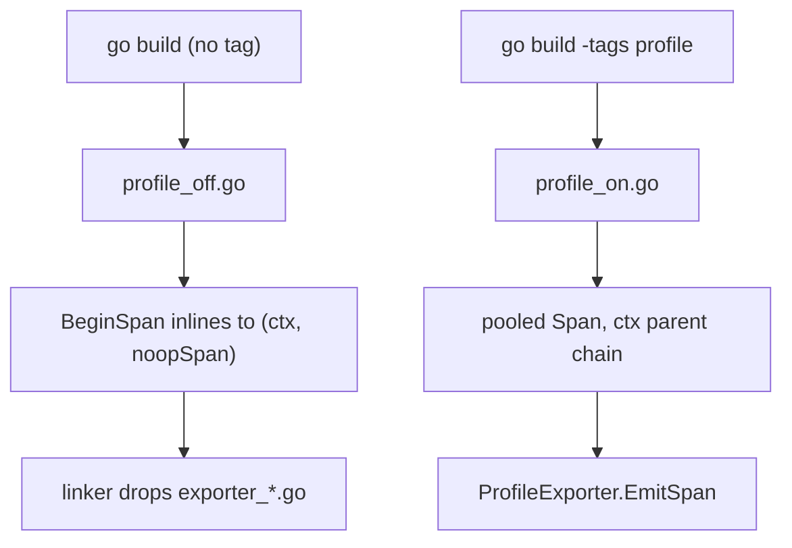

# Profiling Protocol — Go Implementation

**Version:** 0.1.0
**Status:** Draft
**Layer:** go
**Implements:** l1-profiling-protocol.md

## Overview

This specification defines the Go realization of the [Profiling Protocol](l1-profiling-protocol.md): a compile-time-removable instrumentation layer that emits hierarchical, frame-oriented spans to pluggable exporter backends. The design centers on a **dual-file build-tag split** — a `//go:build profile` file carrying the live span machinery and a `//go:build !profile` file carrying inlinable no-op stubs — so that release builds link zero instrumentation code.

It builds directly on the shipped diagnostic infrastructure: [l2-diagnostic-system-go.md](l2-diagnostic-system-go.md) already established build-tag-gated profiling spans and the `DiagnosticsStore` that consumes aggregated span timings. This spec lifts that seed into the full protocol — a pooled span tree, a `context.Context`-propagated parent chain, frame markers, and three exporters. Per the engine's zero-dependency rule (C-003 / RULES.md C32), only **stdlib exporters** (`pprof`, `chrome://tracing` TEF JSON) ship; the Tracy CGo bridge named by the L1 is ADR-gated and deferred.

## Related Specifications

- [l2-diagnostic-system-go.md](l2-diagnostic-system-go.md) — `DiagnosticsStore` + the existing build-tag profiling-span seed this spec generalizes
- [l2-system-scheduling-go.md](l2-system-scheduling-go.md) — DAG scheduler wraps each system dispatch in a `System:{name}` span
- [l2-task-system-go.md](l2-task-system-go.md) — worker-pool tasks carry span context via `context.Context`
- [l2-app-framework-go.md](l2-app-framework-go.md) — `ProfilingPlugin` registration, main-loop `MarkFrame()` placement, `//go:build` isolation
- [l2-render-core-go.md](l2-render-core-go.md) — render passes emit GPU timing spans (backend-specific, deferred)
- [l2-hot-reload-go.md](l2-hot-reload-go.md) — reload-cycle timing spans (`Reload:{phase}`)

## 1. Motivation

Go's `runtime/pprof` captures aggregate CPU/heap profiles but lacks the per-frame timeline a game developer needs to see *which system spiked this frame*. The L1 protocol fills that gap with frame-scoped spans. The Go implementation must satisfy two hard constraints simultaneously:

- **Zero release overhead** — not "small" overhead, *zero*. A non-`profile` build must not contain the span machinery at all, so the linker drops it and the compiler inlines `BeginSpan` to nothing.
- **Zero hot-path allocation** — under the `profile` tag, span creation runs inside the per-system dispatch loop. Allocating a `*Span` per call per frame would itself distort the measurement. Pooling is mandatory.

The dual-file build-tag pattern is the idiomatic Go answer to both: the public API (`BeginSpan`, `(*Span).End`, `MarkFrame`) has two implementations selected at compile time, identical signatures, divergent bodies.

## 2. Constraints & Assumptions

- **C-003 / C32 (zero external deps)**: shipping exporters use only the standard library. `runtime/pprof` (CPU/heap labels) and `encoding/json` (Chrome Trace Event Format) cover the protocol with no third-party code. The **Tracy** exporter (CGo bridge to the Tracy C client) is recorded as a rejected/deferred dependency under an ADR — it is *not* implemented in this contract.
- The package lives at `pkg/diag/profiling/` (sub-package of the already-shipped `pkg/diag`), keeping the diagnostic and profiling surfaces co-located but independently build-taggable.
- Span context propagates through goroutines via `context.Context` values, never thread-local storage (Go has none).
- `min_span_duration` filtering and memory tracking are opt-in via `ProfilingConfig`, off by default.
- GPU timing is backend-specific and depends on render-backend timestamp-query support → **deferred** (interface stubbed, no implementation in the headless/software path).
- All exported identifiers carry `AI-Meta:` stability annotations per [l2-code-documentation-go.md](l2-code-documentation-go.md).

## 3. Core Invariants (Layer 1 only)

This is a Layer 2 specification; the authoritative invariants live in [l1-profiling-protocol.md §3](l1-profiling-protocol.md). They are mapped to their Go realization in §4 below.

## 4. Invariant Compliance (Layer 2 only)

| L1 Invariant | Go Implementation |
| :--- | :--- |
| **INV-1** — zero overhead in release builds | Dual-file split: `profile_on.go` (`//go:build profile`) holds the real `BeginSpan`/`End`/`MarkFrame`; `profile_off.go` (`//go:build !profile`) holds stubs whose bodies are empty (`return ctx, noopSpan` / `func (s *Span) End() {}`). Without the tag the compiler inlines them to nothing and the linker drops the exporter tree. A `TestNoopInlines` escape/cost check + a `go build` size-delta guard prove the binary is unchanged. |
| **INV-2** — zero hot-path allocation | `*Span` objects come from a `sync.Pool` (reuse l2-pool-go's `Pool[Span]`). `BeginSpan` resets and returns a pooled span; `End` returns it to the pool after the exporter copies out the fields it needs. `metadata []KeyValue` is a pre-sized, reused backing array. `testing.AllocsPerRun(BeginSpan→End) == 0` is asserted with `-benchmem`. |
| **INV-3** — every frame boundary marked | The main loop (`l2-app-framework-go`) calls `profiling.MarkFrame()` once per iteration; it closes the open `Frame` span and opens the next with an incrementing `frameNum uint64`. Exporters translate this to `FrameMark` (Tracy, deferred) / a TEF instant `"i"` event (Chrome) / a profile-label boundary (pprof). |
| **INV-4** — strictly hierarchical nesting | Parent linkage flows through `context.Context`: `BeginSpan` reads the current span from `ctx` as `parent_id` and returns a child-carrying `ctx`. `End` on a span asserts (in `profile` builds) that no child of it is still open — a `childOpen` counter guards the LIFO discipline; a violation logs an `E-DIAG-*` error rather than corrupting the tree. `defer span.End()` is the canonical usage, which the AST guard test verifies in instrumented call sites. |
| **INV-5** — pluggable exporters | `ProfileExporter` is an interface (`Init/EmitSpan/EmitFrameMark/Flush/Shutdown`). The instrumentation API depends only on the interface; adding `ChromeExporter` or a future `TracyExporter` touches no `BeginSpan` code. A `MultiExporter` fans one span out to several backends. Registration is via `ProfilingConfig.Exporter`, resolved once at plugin build. |

> All five invariants are addressed. RFC promotion remains blocked by the layer constraint: the L1 parent is `Draft`. Promotion of both proceeds together once implementation lands and the L1 graduates.

## 5. Detailed Design

### 5.1 Package Layout and Build-Tag Split

```plaintext
pkg/diag/profiling/
├── span.go            // (untagged) Span struct, SpanCategory, KeyValue, SpanID — pure data
├── api.go             // (untagged) exported signatures as documented contract + doc comments
├── profile_on.go      // //go:build profile      — live BeginSpan/End/MarkFrame, pool, tree
├── profile_off.go     // //go:build !profile     — inlinable no-op stubs
├── exporter.go        // (untagged) ProfileExporter interface, MultiExporter, ExporterType
├── exporter_pprof.go  // //go:build profile      — runtime/pprof label mapping
├── exporter_chrome.go // //go:build profile      — Trace Event Format JSON writer
├── config.go          // (untagged) ProfilingConfig resource
├── plugin.go          // //go:build profile      — ProfilingPlugin (registers MarkFrame system + exporter)
├── plugin_off.go      // //go:build !profile     — no-op ProfilingPlugin (registers nothing)
└── gpu.go             // (untagged) GPUSpan / GPUTimingCollector interface — DEFERRED stub
```

The **untagged** files compile in every build so that `*Span`, `SpanCategory`, and `ProfilingConfig` remain referenceable type names even in release builds (a system may hold a `ProfilingConfig` field without pulling in the machinery). Only the *behavior* is tag-gated.

```plaintext
// api.go — the contract both implementations satisfy (signatures only here for doc):
func BeginSpan(ctx context.Context, name string, cat SpanCategory) (context.Context, *Span)
func (s *Span) End()
func (s *Span) Annotate(key string, value any)   // append KeyValue, no-op in release
func MarkFrame()
```

**Flow Diagram — compile-time selection:**



### 5.2 Span Lifecycle (profile build)

```plaintext
BeginSpan(ctx, name, cat):
    s          := spanPool.Get()           // *Span from sync.Pool (Pool[Span])
    s.reset()                              // clear metadata len, ids, ticks
    s.name      = name
    s.category  = cat
    s.startNs   = monotonicNow()           // time.Now() against process monotonic clock
    s.parentID  = spanFromContext(ctx)     // 0 if root
    s.threadID  = osThreadID()             // runtime — for timeline lane placement
    childCtx   := context.WithValue(ctx, spanKey, s.id)
    return childCtx, s

(s *Span) End():
    s.endNs = monotonicNow()
    if cfg.minSpanDuration > 0 && s.duration() < cfg.minSpanDuration {
        spanPool.Put(s); return            // noise filter — never reaches exporter
    }
    if cfg.memoryTracking { s.attachMemDelta() }
    exporter.EmitSpan(*s)                  // VALUE copy — exporter must not retain the pointer
    spanPool.Put(s)                        // safe to recycle after value emit
```

The value-copy at `EmitSpan(*s)` is the linchpin of INV-2: the pooled pointer is recycled immediately, the exporter owns an independent copy. Exporters that buffer (Chrome) copy the small `Span` into their own slice; streaming exporters (Tracy) consume it synchronously.

### 5.3 Frame Markers (INV-3)

```plaintext
package-level state (profile build only):
    var frameNum uint64
    var frameSpan *Span

MarkFrame():
    if frameSpan != nil {
        frameSpan.End()                    // close previous frame
    }
    atomic.AddUint64(&frameNum, 1)
    _, frameSpan = BeginSpan(context.Background(), "Frame", CategoryCustom)
    exporter.EmitFrameMark(frameNum)
```

`MarkFrame` is driven by a `Last`-schedule system registered by `ProfilingPlugin`, mirroring how `l2-diagnostic-system-go` runs its overlay in the `Last` schedule — single call site, deterministic placement at the frame boundary.

### 5.4 Automatic Instrumentation

The scheduler integration wraps each system dispatch without per-system manual code:

```plaintext
// In l2-system-scheduling-go's executor, behind //go:build profile:
ctx, span := profiling.BeginSpan(ctx, "System:"+sys.Name(), profiling.CategorySystem)
sys.Run(ctx, world)
span.End()
```

In a non-`profile` build the same call site compiles to `sys.Run(ctx, world)` plus two inlined no-ops — verified by the cost guard. Auto-instrumented span names follow the L1 catalog (`Schedule:{name}`, `System:{name}`, `RenderPass:{name}`, `AssetLoad:{type}:{path}`, `Reload:{phase}` from [l2-hot-reload-go.md](l2-hot-reload-go.md)).

### 5.5 Exporters (stdlib-only)

```plaintext
ProfileExporter (interface — exporter.go, untagged):
    Init() error
    EmitSpan(span Span)
    EmitFrameMark(frame uint64)
    Flush() error
    Shutdown() error

PprofExporter (exporter_pprof.go, //go:build profile):
    - Maps each span to a pprof label set via runtime/pprof.Do / pprof.Labels.
    - "system", "category", "frame" become filterable labels:
        go tool pprof -focus=physics_step
    - No buffering — labels are attached for the duration of the span's goroutine.
    - Pure Go, no CGo. Reuses the engine's existing net/http/pprof endpoint exposure
      (DiagnosticsPlugin) — see l2-diagnostic-system-go.

ChromeExporter (exporter_chrome.go, //go:build profile):
    - Buffers spans, writes Trace Event Format (TEF) JSON via encoding/json.
    - Duration events:  {"ph":"X","name":..,"ts":start_us,"dur":..,"pid":0,"tid":thread_id}
    - Frame marks:      {"ph":"i","name":"Frame N","ts":..,"s":"g"}
    - File rotation: new file per session at cfg.chromeOutputPath; Flush on Shutdown.
    - Viewable in chrome://tracing or Perfetto.

MultiExporter (exporter.go, untagged):
    - []ProfileExporter; fans EmitSpan/EmitFrameMark to each. Enables Pprof+Chrome together.

TracyExporter:  NOT IMPLEMENTED. CGo + third-party C client → rejected under C-003/C32.
                Recorded as a deferred-dependency ADR. The interface leaves room for it
                without any change to instrumentation code (INV-5).
```

### 5.6 Memory Tracking (opt-in)

```plaintext
(s *Span) attachMemDelta():     // only when cfg.memoryTracking
    var m runtime.MemStats
    runtime.ReadMemStats(&m)     // NOTE: stop-the-world; documented as heavyweight,
                                 // intended for targeted profiling sessions, not always-on.
    s.Annotate("alloc_bytes", m.TotalAlloc - s.allocSnapshot)
    s.Annotate("gc_pauses",  m.NumGC      - s.gcSnapshot)
```

`ReadMemStats` is STW and must not run on the hot path by default — hence the opt-in gate. The contract documents this sharp edge explicitly rather than hiding it.

### 5.7 Configuration Resource

```plaintext
ProfilingConfig (config.go, untagged — an ECS resource):
    Enabled          bool           // master switch; also requires the profile build tag
    Exporter         ExporterType   // Pprof | Chrome | Multi  (Tracy reserved, unimplemented)
    AutoInstrument   bool           // wrap systems/passes automatically
    MemoryTracking   bool           // STW ReadMemStats per span — default false
    GPUTiming        bool           // deferred; default false
    ChromeOutputPath string
    MinSpanDuration  time.Duration  // skip shorter spans
    CustomCategories []string
```

`Enabled` is a runtime switch *within* a `profile` build; the build tag is the outer gate. Both must be true for spans to emit — this lets a `profile` binary ship with profiling dormant until toggled.

### 5.8 GPU Timing (deferred)

`gpu.go` declares `GPUSpan` and the `GPUTimingCollector` interface as documented stubs. No backend in the current software/headless render path supports timestamp queries, so there is no implementation. The interface exists so a future hardware backend can satisfy it without an L1 amendment — correlation with CPU spans is by `frameNum`, exactly as the L1 specifies.

## 6. Implementation Notes

1. `span.go` + `api.go` + `config.go` + `exporter.go` (untagged data/interfaces) — prerequisite for everything; these compile in all builds.
2. `profile_off.go` (no-op stubs) — author *before* the live path so release builds stay green throughout development.
3. `profile_on.go` (pool, tree, context chain) + `TestNoopInlines` / alloc guards — the core.
4. `exporter_chrome.go` then `exporter_pprof.go` — Chrome first (pure data, easiest to golden-test against a TEF fixture).
5. `plugin.go` / `plugin_off.go` + scheduler `System:` wrap — wires it into the loop.
6. `gpu.go` stub + ADR for the rejected Tracy dependency — closes the contract.

## 7. Drawbacks & Alternatives

- **No Tracy out of the box.** The L1's headline real-time GUI is unavailable in a pure-stdlib build. Mitigation: Chrome/Perfetto TEF gives a comparable timeline view; the interface keeps Tracy a drop-in for anyone who accepts the CGo dependency under their own ADR.
- **Dual-file maintenance cost.** Every API signature change must touch both `profile_on.go` and `profile_off.go` or the non-`profile` build breaks. Mitigation: the signatures are frozen in `api.go`'s doc block and a `go vet`-style parity is covered by building both tag configurations in CI.
- **`context.Context` propagation overhead.** `WithValue` allocates a small wrapper per `BeginSpan`. Considered alternative: an explicit `*spanStack` passed by pointer. Rejected — it would force every instrumented signature to change and break the idiomatic `ctx`-first convention the rest of the engine follows. The `WithValue` wrapper is itself elided in release builds (no-op path returns `ctx` unchanged).
- **STW `ReadMemStats`.** Per-span memory deltas are expensive. Accepted as opt-in only.

## Canonical References

<!-- MANDATORY for Stable status. Stub state — this L2 is Draft (L1 parent Draft +
     no implementation yet). Populate with on-disk source/test/example files when
     implementation lands (Phase 7). Stable promotion requires >=1 row. -->

| Alias | Path | Purpose |
| :--- | :--- | :--- |

<!-- Empty table = no implementation yet. One row per authoritative file when code lands. -->

## Document History

| Version | Date | Description |
| :--- | :--- | :--- |
| 0.1.0 | 2026-06-04 | Initial Draft: dual-file build-tag span machinery, pooled zero-alloc spans, context-propagated hierarchy, stdlib pprof + Chrome TEF exporters, Tracy deferred under ADR, GPU timing stubbed. Implements l1-profiling-protocol. |
